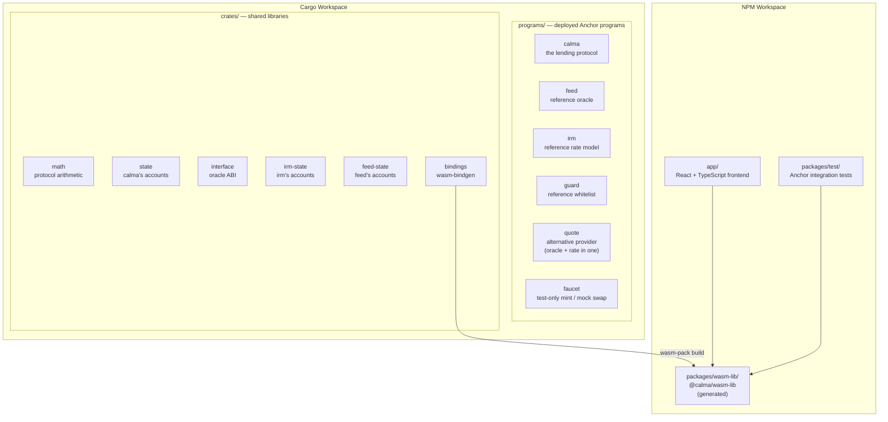
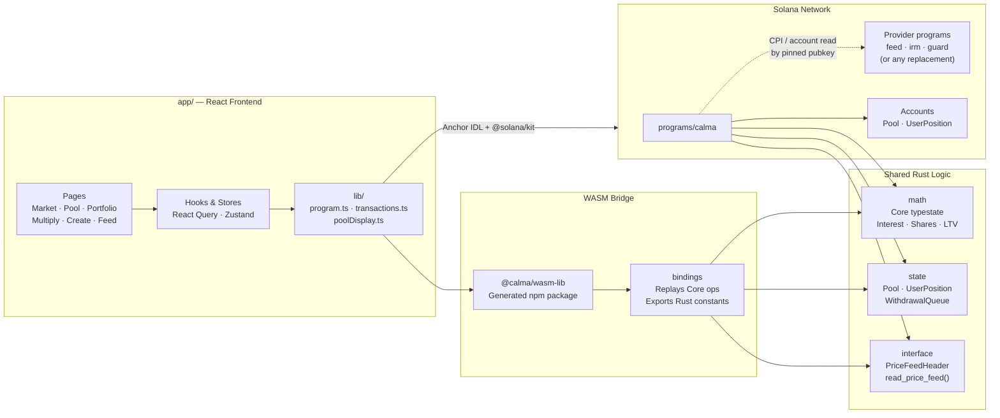
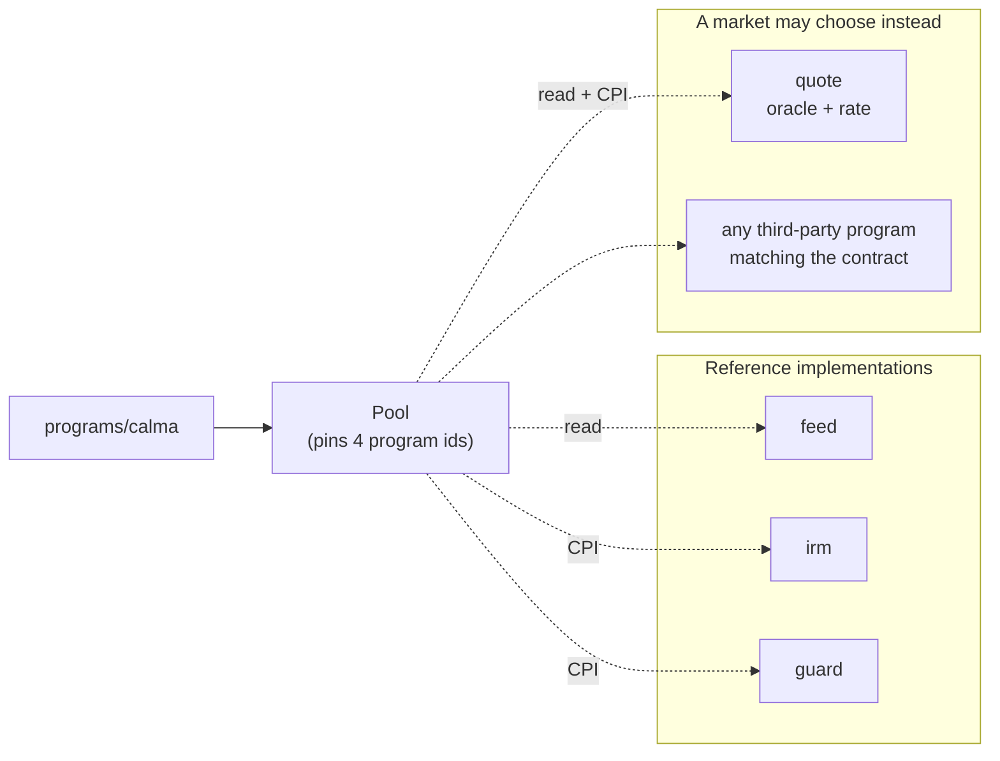
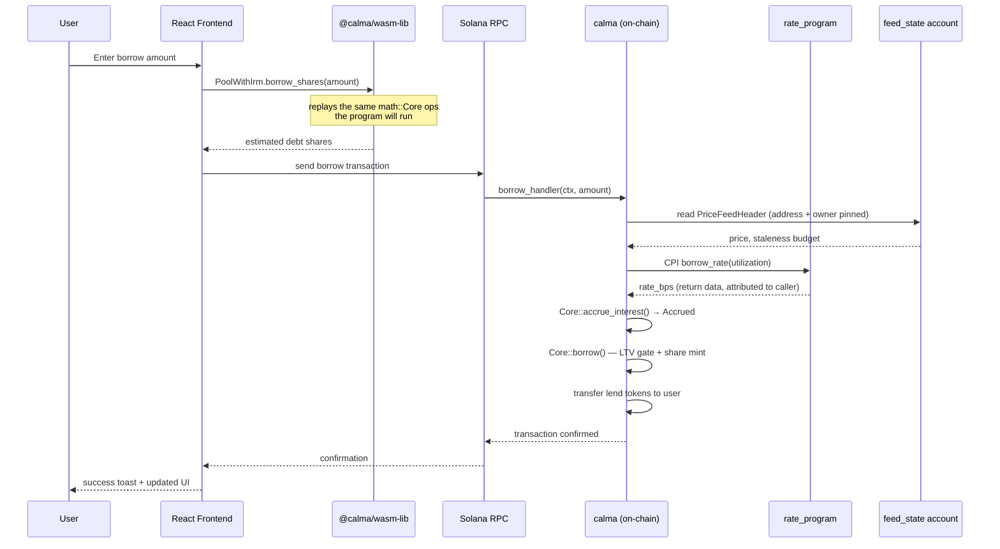
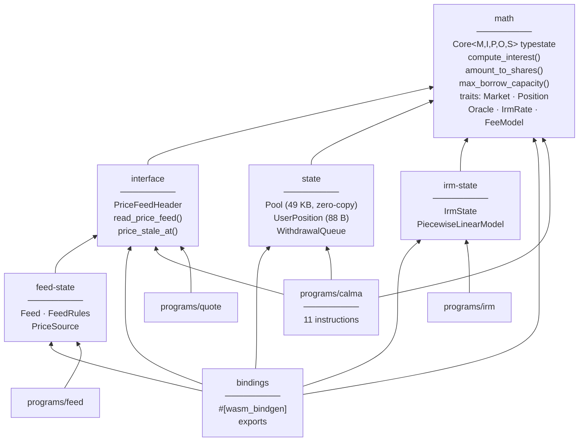
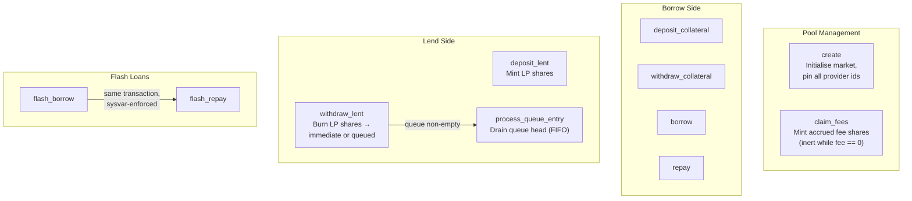
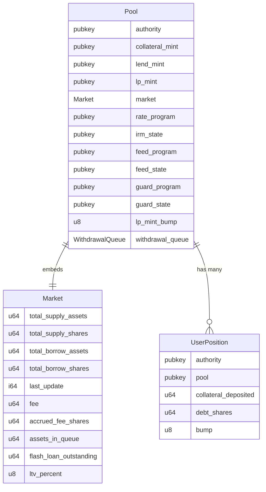
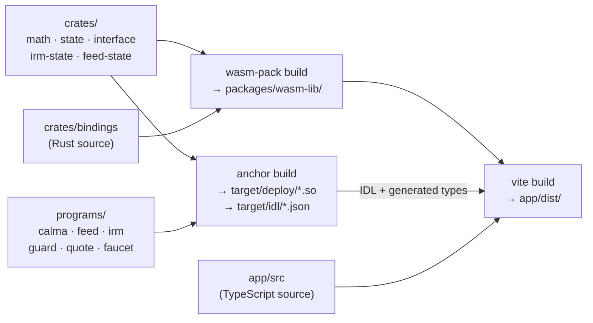

# Architecture

Calma is a decentralized lending protocol on Solana. Users deposit collateral to borrow tokens and lenders earn LP yields.

> The fixed-rate hedging subsystem was removed before launch — see [docs/rate-hedge-removal.md](docs/rate-hedge-removal.md).
>
> This document describes how the system is *put together*. For what it does
> **not** guarantee — accepted risks and open defects, including the absence of a
> liquidation path — see [docs/known-issues.md](docs/known-issues.md). Read that
> before reasoning about what the protocol protects.

---

## Monorepo Structure

> **No program links another program.** `calma` reaches its oracle, rate model
> and whitelist through pubkeys recorded on its own `Pool`, never through a
> Cargo dependency — see [Pluggable providers](#pluggable-providers) and
> `.claude/rules/program-dependencies.md`.

---

## Component Overview

---

## Pluggable providers

A market records four provider pubkeys on its own `Pool` at creation and they are
immutable afterwards. `calma` knows the *shape* of each role, never the identity
of an implementation — which is why `programs/quote` can serve a market as both
oracle and rate model despite `calma` never having linked it.

| Role | Pinned on `Pool` | Mechanism | Contract |
|------|------------------|-----------|----------|
| Oracle | `feed_state` + `feed_program` | **Passive account read** — no CPI | Account begins with `interface::PriceFeedHeader` after its 8-byte discriminator; `read_price_feed` checks address *and* owner |
| Rate model | `irm_state` + `rate_program` | CPI, hand-rolled discriminator | Instructions named `borrow_rate(u64)` and `check_authority(Pubkey)`; accounts `[irm_state, pool]`; rate returned as `u32` LE in return data |
| Whitelist | `guard_state` + `guard_program` | CPI, hand-rolled discriminator | Instruction named `check(Pubkey)`; account `[guard_state]` |

The discriminators are `sha256("global:<name>")[..8]`, hardcoded in
`programs/calma/src/hooks/{irm,guard}.rs` and asserted against Anchor's own
derivation by a unit test in each file. The oracle role has no discriminator to
check on purpose: every implementation names its account struct differently, and
the address is already pinned to one exact account.

---

## Data Flow — Borrow Example

---

## Rust Crate Dependencies

`math` depends on nothing — not even `anchor-lang`. That is what lets the exact
same arithmetic run on-chain and in the browser.

`programs/guard` and `programs/faucet` depend on no workspace crate.

---

## On-Chain Program Instructions

`programs/calma` exposes **11** instructions.

Guarded entry points (`deposit_collateral`, `borrow`, `deposit_lent`) call the
whitelist. Exits (`repay`, `withdraw_collateral`, `withdraw_lent`,
`process_queue_entry`) are deliberately never gated, so a de-whitelisted user can
always leave. `repay` and `deposit_collateral` do not read the oracle at all.

---

## Account State

Supply- and borrow-side accounting lives in a nested `Market` struct rather than
directly on `Pool`; the field names below are the current ones (see
`crates/state/src/state/pool.rs`).

> Collateral is **not** totalled on `Pool` — it is tracked per `UserPosition`
> only, and the vault balance is the aggregate.

---

## Build Pipeline

`npm run setup` runs the whole chain once. `packages/wasm-lib/` is generated
output and is never committed — the app cannot typecheck against a new Rust
export until `npm run wasm` regenerates it.
