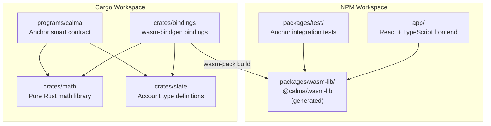
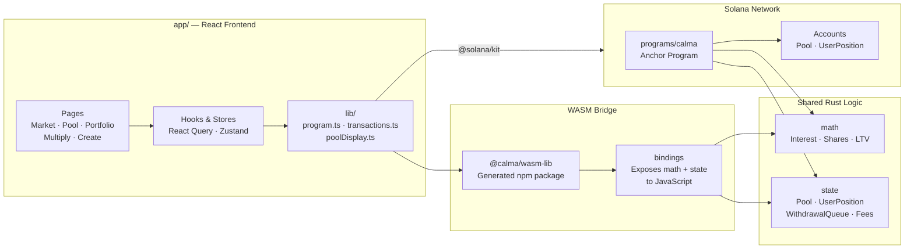
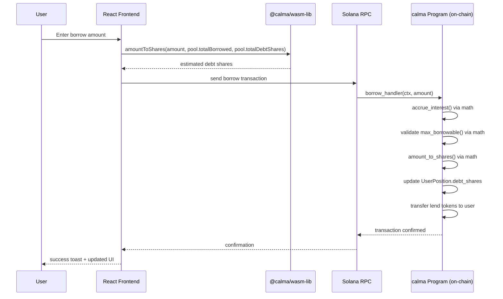
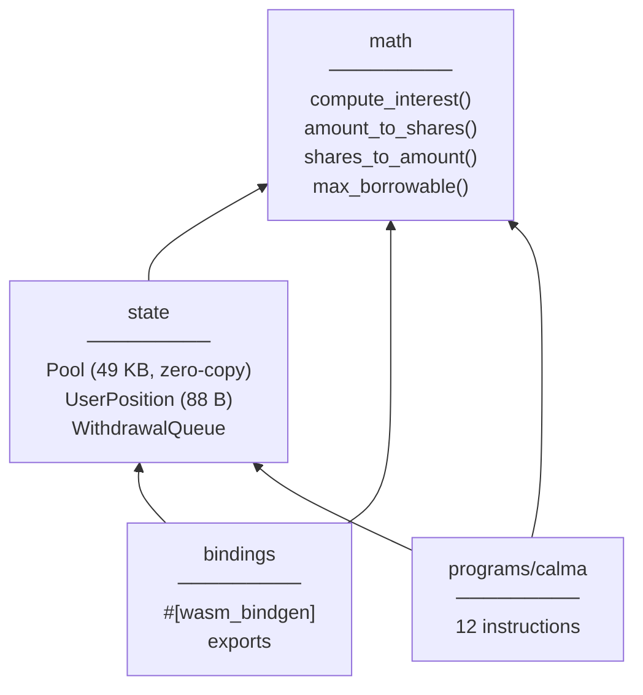
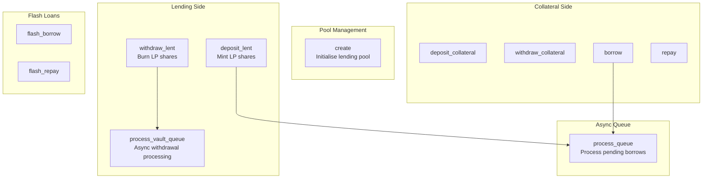
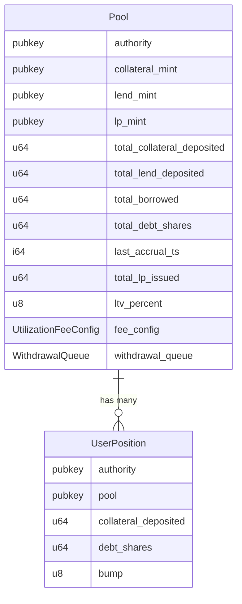
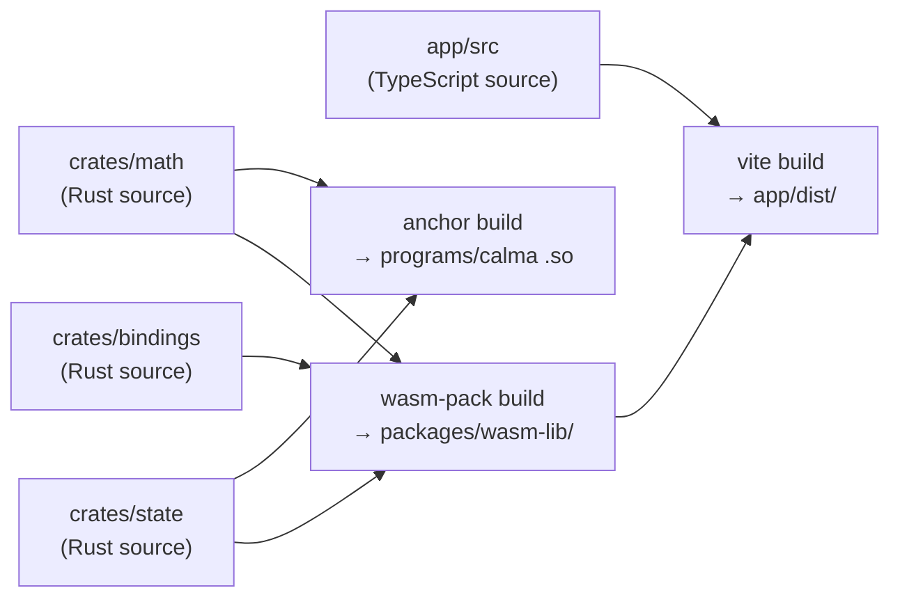

# Architecture

Calma is a decentralized lending protocol on Solana. Users deposit collateral to borrow tokens and lenders earn LP yields.

> The fixed-rate hedging subsystem was removed before launch — see [docs/rate-hedge-removal.md](docs/rate-hedge-removal.md).

---

## Monorepo Structure

---

## Component Overview

---

## Data Flow — Borrow Example

---

## Rust Crate Dependencies

---

## On-Chain Program Instructions

---

## Account State

---

## Build Pipeline

