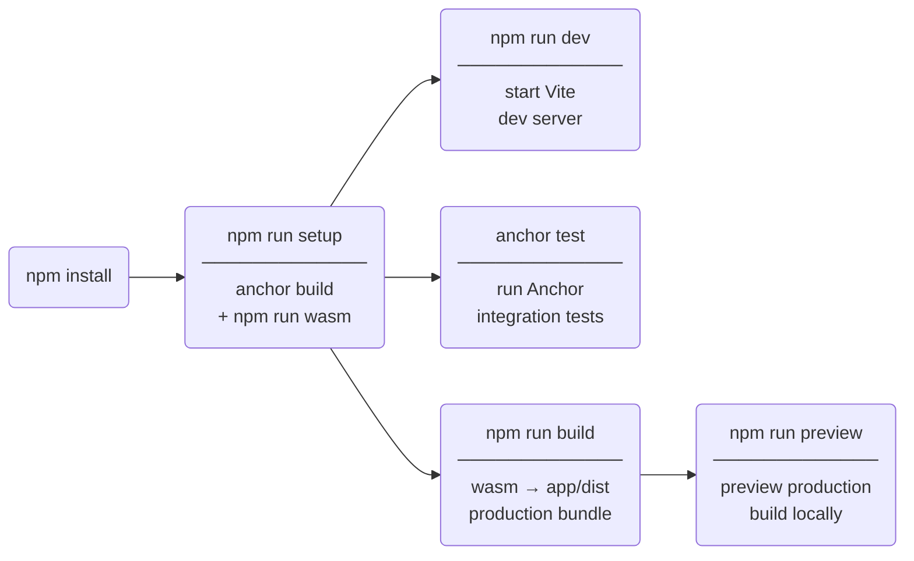

# calma

A Solana lending protocol with an Anchor program and a React/Vite frontend.

## Setup



> **Prerequisites:** [Rust](https://rustup.rs), [Anchor CLI](https://www.anchor-lang.com/docs/installation), [wasm-pack](https://rustwasm.github.io/wasm-pack/installer/), [Node.js](https://nodejs.org) (npm)

## Repository layout

```
programs/calma/     The lending program. Links no other program (see below).
programs/feed/      Reference oracle — Pyth pull, Pyth push, or manual prices
programs/irm/       Reference interest-rate model — piecewise-linear curve
programs/guard/     Reference whitelist gate
programs/quote/     Alternative provider: oracle + rate model in one program,
                    used to prove a market can run on code calma never linked
programs/faucet/    Test-only mint / mock swap. Never deploy beside a real pool.

crates/math/        Pure-Rust protocol arithmetic. Zero dependencies — not even
                    anchor-lang — so the same code runs on-chain and in wasm.
crates/state/       calma's own account layouts (Pool, UserPosition, queue)
crates/interface/   The oracle ABI: PriceFeedHeader + read_price_feed.
                    Declares no program id, on purpose.
crates/irm-state/   programs/irm's account layouts + curve validation
crates/feed-state/  programs/feed's account layouts + ingestion rules
crates/bindings/    Wasm entrypoint — replays math::Core ops for the browser

packages/wasm-lib/  Generated @calma/wasm-lib npm package (output of `npm run wasm`)
packages/test/      End-to-end tests (TypeScript, against a validator)
app/                React + TypeScript + Vite frontend
landing/            Marketing site
```

A market reaches its oracle, rate model and whitelist through pubkeys pinned on
its own `Pool` account, never through a Cargo dependency — so `programs/calma`
depends on no other program, and any program matching the contract can serve a
market. See [ARCHITECTURE.md](ARCHITECTURE.md#pluggable-providers) and
`.claude/rules/program-dependencies.md`.

> **Before relying on any of this**, read [docs/known-issues.md](docs/known-issues.md).
> It records the protocol's accepted risks and open defects — most importantly,
> that there is no liquidation path.

---

## math — Rust crate

`crates/math` contains the shared interest and share-conversion math used by both the on-chain program and the browser frontend.

### Using from Rust

Included as a path dependency in `programs/calma/Cargo.toml`:

```toml
[dependencies]
math = { path = "../../crates/math" }
```

```rust
use math::{compute_interest, amount_to_shares, shares_to_amount, amount_to_shares_burned};
```

### Using from the frontend (WebAssembly)

`crates/bindings` exposes math + state to JavaScript via [wasm-bindgen](https://rustwasm.github.io/wasm-bindgen/) and is packaged as `@calma/wasm-lib`.

#### Prerequisites

Install [wasm-pack](https://rustwasm.github.io/wasm-pack/installer/):

```sh
cargo install wasm-pack
```

#### Build

From the repo root:

```sh
npm run wasm
```

This is equivalent to:

```sh
cargo build --target wasm32-unknown-unknown
wasm-pack build crates/bindings --target bundler --out-dir "$PWD/packages/wasm-lib"
```

The generated package is written to `packages/wasm-lib/` and consumed as `@calma/wasm-lib` — rebuild whenever the crate changes.

#### Import in TypeScript

```ts
import { sharesToAmount, computeInterest, amountToShares, amountToSharesBurned } from '@calma/wasm-lib'

// The bundler target auto-initializes the .wasm binary on import — no init() call needed.
// All u64 arguments and return values use JavaScript BigInt.
// Option<u64> return types map to bigint | undefined (undefined on overflow).
const interest = computeInterest(1_000_000n, 500, 31_557_600n)
```

#### Vite integration

`vite-plugin-wasm` is already configured in `app/vite.config.ts` — no additional setup is needed.

---

## Frontend (app/)

```sh
npm install
npm run wasm   # compile crates/bindings → packages/wasm-lib (required before dev/build)
npm run dev
```

---

## Anchor program

```sh
anchor build
anchor test
```
